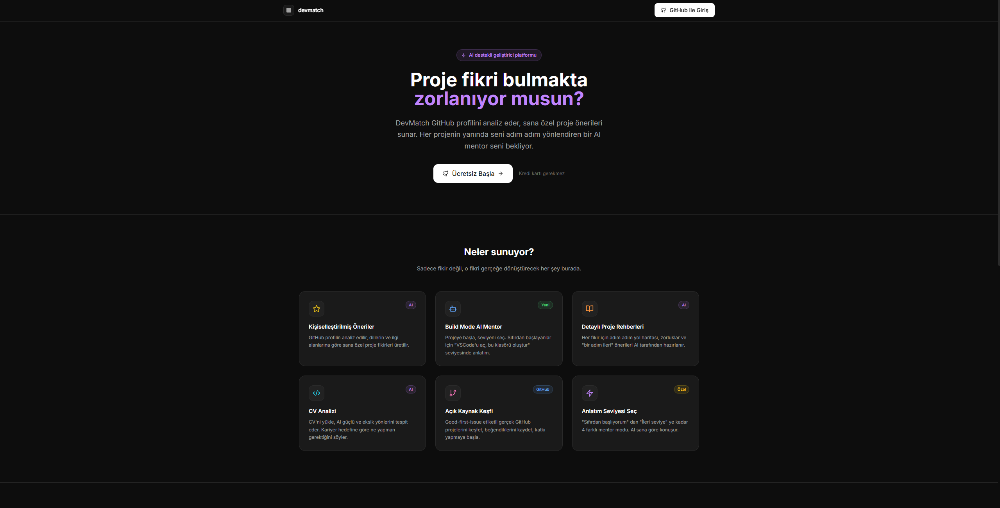
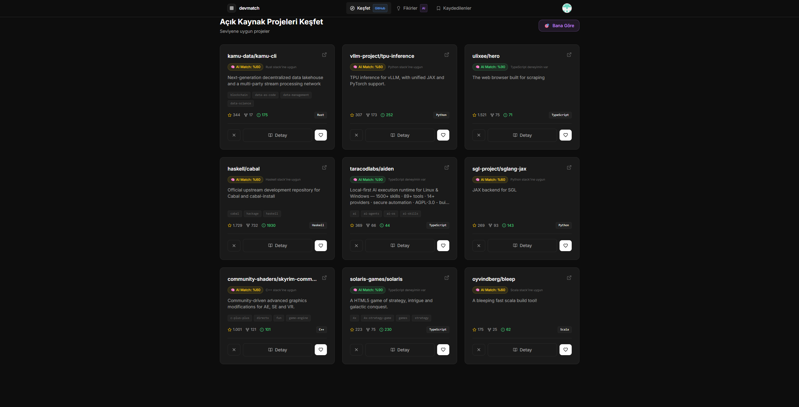
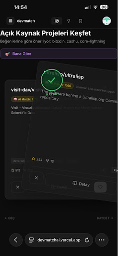
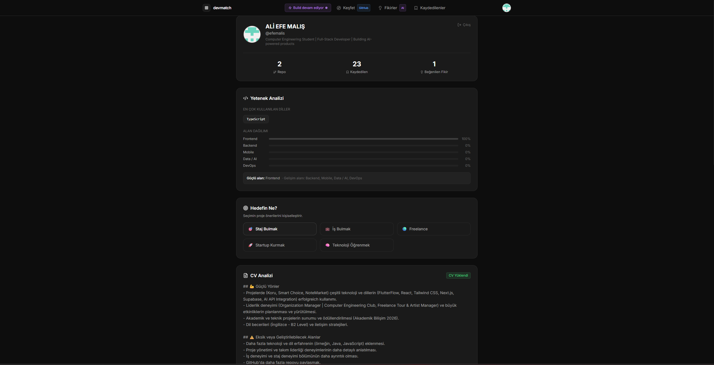
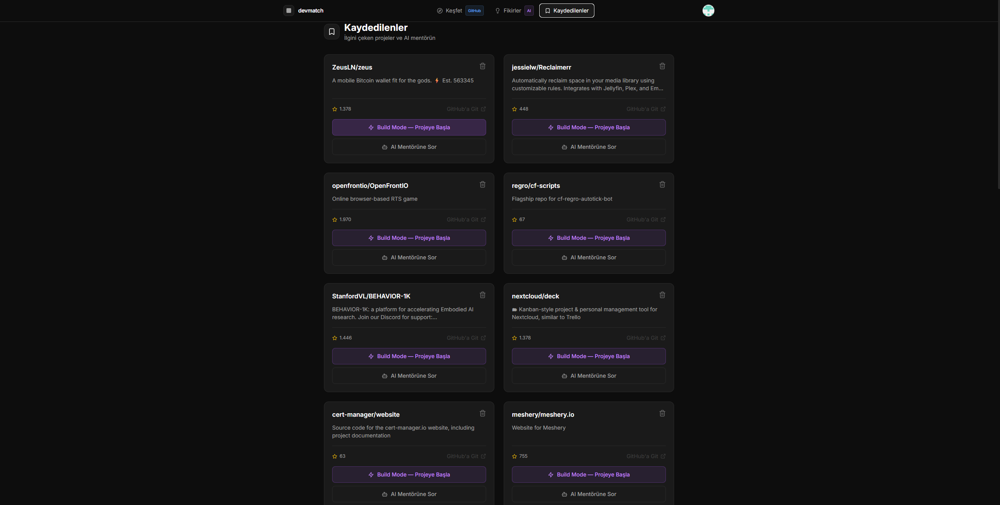
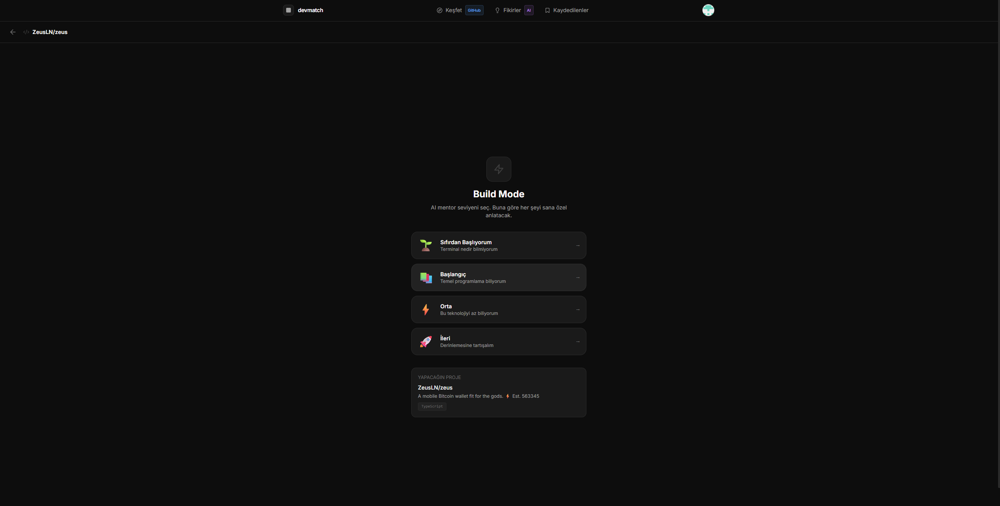

# 🚀 DevMatch | AI-Powered Developer Growth Platform

> DevMatch analyzes developers’ GitHub profiles and guides them from project idea to production with a context-aware AI mentor.

DevMatch is an end-to-end developer platform that solves the age-old question: *"What project should I build, and how should I build it?"*

By analyzing users' GitHub profiles and CVs, it understands their technical levels and interests, recommends the most suitable projects, and most importantly, guides them from scratch to production with a **context-aware AI Mentor**.

---

## ✨ Core Features

- 🎯 **Personalized Project Discovery:** Custom project recommendations based on your GitHub profile.
- 🔍 **Swipe-Based UX (Tinder Style):** Quickly discover, like, or skip projects with a seamless mobile-like experience.
- 🧠 **AI Match Score:** Instantly see how well each project matches your current skill set.
- 📋 **Build Mode:** Select a project and build it step-by-step tailored to your level.
- 💬 **Context-Aware AI Mentor:** An AI that already knows your project's tech stack to generate code and debug errors.
- 📄 **CV Analysis & Skill Radar:** Analyzes your CV to highlight missing skills and pinpoint areas for career growth.

---

## 📸 Project Showcase

<table width="100%" style="border-collapse: separate; border-spacing: 0 15px;">
  <tr>
    <td width="50%" align="center" style="padding-right: 10px;">
      <a href="https://devmatchai.vercel.app" target="_blank">
        <br/>
      </a>
      <br/><b>🚀 Landing & Onboarding</b><br/>
      <span style="font-size: 12px; color: #888;">Modern, dark-themed entry point explaining core features.</span>
    </td>
    <td width="50%" align="center" style="padding-left: 10px;">
      <br/>
      <br/><b>🔍 Discover Projects</b><br/>
      <span style="font-size: 12px; color: #888;">AI Match Scored project recommendations based on GitHub data.</span>
    </td>
  </tr>
  
  <tr>
    <td width="50%" align="center" style="padding-right: 10px;">
      <br/>
      <br/><b>📱 Mobile Swipe UX (Tinder Style)</b><br/>
      <span style="font-size: 12px; color: #888;">Intuitive drag-to-like interface for mobile discovery.</span>
    </td>
    <td width="50%" align="center" style="padding-left: 10px;">
      <br/>
      <br/><b>📄 Profile & CV Analysis</b><br/>
      <span style="font-size: 12px; color: #888;">Skill radar and AI-powered feedback on your resume.</span>
    </td>
  </tr>

  <tr>
    <td width="50%" align="center" style="padding-right: 10px;">
      <br/>
      <br/><b>⭐ Saved Dashboard</b><br/>
      <span style="font-size: 12px; color: #888;">Manage your liked ideas and jump straight into coding.</span>
    </td>
    <td width="50%" align="center" style="padding-left: 10px;">
      <br/>
      <br/><b>📋 Build Mode & AI Mentor</b><br/>
      <span style="font-size: 12px; color: #888;">Step-by-step guidance tailored to your technical level.</span>
    </td>
  </tr>
</table>

---

## 🛠️ Tech Stack

- **Frontend:** React + Vite + TypeScript + Tailwind CSS  
- **Backend:** Supabase (PostgreSQL, Auth, Edge Functions)  
- **AI:** Groq API (llama-3.3-70b-versatile)  
- **Animations:** Framer Motion  

---

## ⚙️ Local Development

```bash
git clone [https://github.com/efemalis/devmatch.git](https://github.com/efemalis/devmatch.git)
cd devmatch
npm install

Create a .env.local file in the root directory:

Plaintext
VITE_SUPABASE_URL=your_supabase_url
VITE_SUPABASE_ANON_KEY=your_anon_key

Run the project:

Bash
npm run dev
🌐 Live Demo 👉 https://devmatchai.vercel.app/
